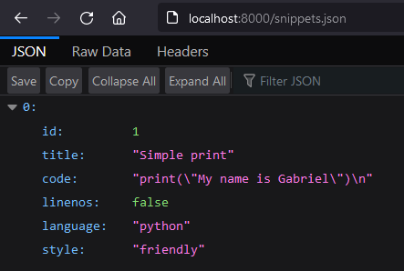
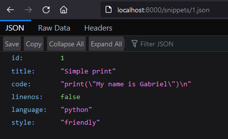

# Notes

- The DRF provides two special objects out of the box:

  - The `Request` object makes parsing easier. The `request.data` property can handle arbitrary data and works for `POST`, `PUT` and `PATCH` operations.
    - We can add support for specific format suffixes to the endpoints. This gives us URLs that refer to a given format.
    
    
    
  
  - The `Response` object takes unrendered content and uses [content negotiation](https://restfulapi.net/content-negotiation/) to determine the correct return type.

- It also provides a series of status codes for readability. Using an identifier (such as `HTTP_400_BAD_REQUEST`) from the `status` module is easier to understand than just `400`.

- To write API views, we can use two wrappers. Any of them helps us make sure we receive `Request` instances in our views and adds context to the `Response` objects. They also return the number and text of HTTP status codes and handle parse errors when receiving malformed input in `request.data`.
  - The `@api_view` decorator (for function-based views)
  - The `APIView` class (for class-based views)
  
- By default, the API returns a [browsable API](https://www.django-rest-framework.org/topics/browsable-api/) if accessed through a web browser. This makes developing and using it much easier.